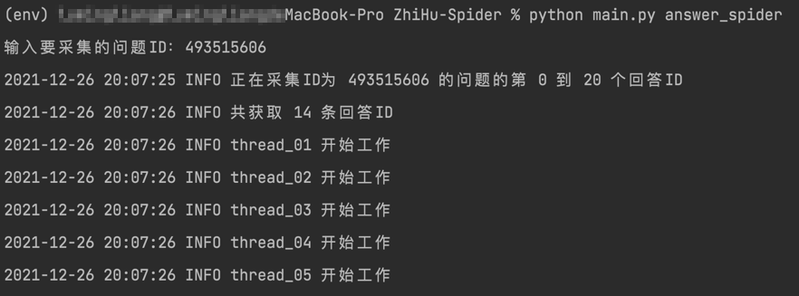
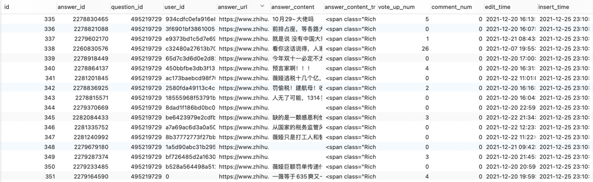
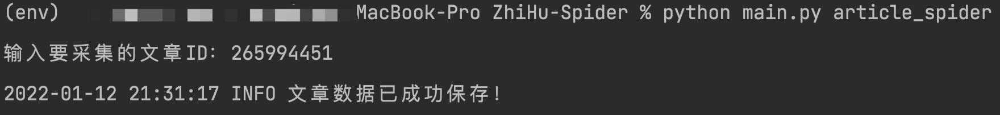

## 知乎爬虫系统
### 主要功能
- [x] 采集单个问题的回答信息
- [ ] 采集单个问题的基本信息
- [ ] 采集单个问题的相关问题
- [ ] 采集单个问题的回答者信息
- [x] 采集单篇文章的基本信息
### 支持的数据导出模式
- [x] .xlsx文件（默认）
- [x] mysql
- [x] mongo
### 支持的连接模式
- [x] 不使用代理（默认）
- [x] 使用代理
### 下载
#### 方式一
点击 [该链接](https://minhaskamal.github.io/DownGit/#/home?url=https://github.com/xll-1994/Spider-Collection/tree/master/ZhiHu-Spider) 单独下载 **ZhiHu-Spider** 项目文件夹
#### 方式二
下载 **Spider-Collection** 仓库中全部项目文件夹
```shell
git clone https://github.com/xll-1994/Spider-Collection.git
```
### 配置运行环境
```shell
# 进入项目目录
cd ZhiHu-Spider

# 全局安装virtualenv用于创建虚拟环境
pip3 install virtualenv
# 如果上面的命令安装失败，则需要切换到国内的镜像源
pip3 install virtualenv -i http://mirrors.aliyun.com/pypi/simple/ --trusted-host mirrors.aliyun.com

# 创建虚拟环境
virtualenv --python=python3 env

# 激活虚拟环境
source env/bin/activate # Mac OS 用这个
env\Scripts\activate.bat # Windows 用这个

# 安装依赖包
pip3 install -r requirements.txt
```
### 配置导出模式（setting.py）
将希望用到的导出模式的值改为1，其余设置为0
```python
# ---------- EXPORT INFO ---------- #
# 默认使用.xlsx文件存储导出的数据
# .xlsx文件将被保存在data文件夹下
USE_MYSQL = 0
USE_MONGO = 0
USE_XLSX = 1
# ---------- EXPORT INFO ---------- #
```
### 配置爬虫能力（setting.py）
```python
# ---------- SPIDER CONFIG ---------- #
# 默认开启线程数为2个
THREAD_NUM = 2
# 默认每个请求发起前睡眠1秒
INTERVAL_TIME = 1
# ---------- SPIDER CONFIG ---------- #
```
### 配置连接模式（setting.py）
我这里使用了 **@J_hao104** 的 **[proxy_pool](https://github.com/jhao104/proxy_pool)** 项目。如果你使用了同款项目，只需在本地开启这个代理池，并将USE_PROXY的值改为1就能无缝调用代理池中的IP了。
```python
# ---------- PROXY CONFIG ---------- #
# 启用代理进行访问时，需保证已配置对应的API访问接口
USE_PROXY = 0
PROXY_HOST = '127.0.0.1'
PROXY_PORT = 5010
# ---------- PROXY CONFIG ---------- #
```
### 采集单个问题的回答信息
#### 数据库建设
|数据库字段|含义|
| :------------: | :--------------: |
|  question_id   | 问题ID |
|   answer_id    | 答案ID |
|    user_id     | 用户ID |
| answer_content |     回答内容     |
|  vote_up_num   |      点赞数      |
|  comment_num   |      评论数      |
|   edit_time    |     回答时间     |
|  insert_time   |     采集时间     |
#### 运行
输入以下命令，并在提示框填入问题ID
```shell
python main.py answer_spider
```

#### 备注
如果回答里面只有视频、图片，那么采集到的answer_content就是空的，如果答题者是匿名回答问题的，那么user_id就是0。

### 采集单篇文章的基本信息
#### 数据库建设
|数据库字段|含义|
|:---:|:---:|
|article_id|文章ID|
|user_id|用户ID|
|title|标题|
|tag|标签|
|content|内容|
|vote_up_num|赞同数|
|comment_num|评论数|
|edit_time|编辑时间|
|insert_time|采集时间|
#### 运行
输入以下命令，并在提示框填入文章ID
```shell
python main.py article_spider
```

